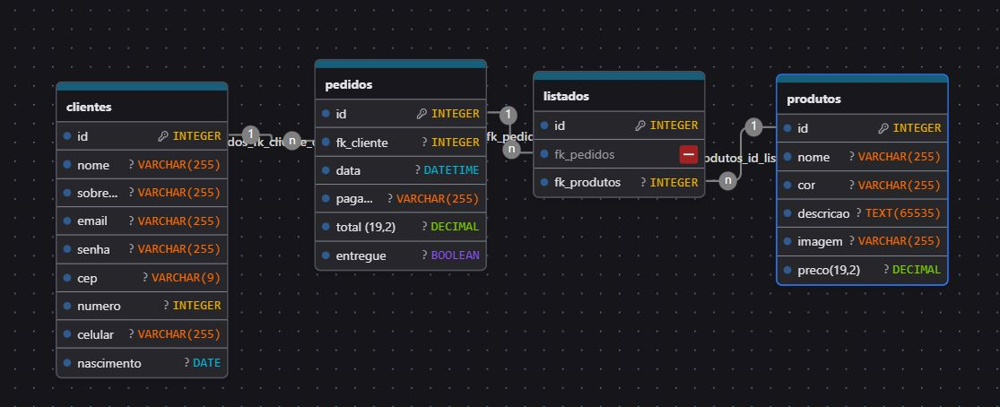

### Makrama e-commerce
home, produtos, login, cadastro, carrinho, admin page, sobre

## DrawDB - Diagrama DER/MER

## SQL Code

~~~~sql
create database makrama
DEFAULT CHARACTER SET utf8
DEFAULT COLLATE utf8_general_ci;

use makrama 

create table clientes(
id int AUTO_INCREMENT not null PRIMARY KEY,
nome varchar(255) not null,
sobrenome varchar(255) not null,
email varchar(255)not null unique,
senha varchar(255) not null,
cep varchar(9)not null,
numero int not null,
celular varchar(255),
nascimento date not null
) DEFAULT CHARACTER SET utf8mb4 COLLATE utf8mb4_unicode_ci;

CREATE TABLE pedidos(
    id int auto_increment not null primary key,
    fk_cliente int not null,
    data datetime not null,
    pagamento varchar(255) not null,
    total decimal(19,2),
    entregue boolean not null
)DEFAULT CHARACTER SET utf8mb4 COLLATE utf8mb4_unicode_ci;

create table listados(
    id int primary key auto_increment not null,
    fk_pedidos int not null,
    fk_produtos int not null
)DEFAULT CHARACTER SET utf8mb4 COLLATE utf8mb4_unicode_ci;

create table produtos(
    id int not null auto_increment primary key,
    nome varchar(255) not null,
    cor varchar(255) not null,
    descricao text not null,
    imagem varchar(255) not null,
    preco decimal(19,2) not null,
    tipo varchar(255) not null
)DEFAULT CHARACTER SET utf8mb4 COLLATE utf8mb4_unicode_ci;

alter table pedidos
ADD CONSTRAINT FOREIGN KEY(fk_cliente) REFERENCES clientes(id)

alter table listados
ADD CONSTRAINT FOREIGN KEY(fk_pedidos) REFERENCES pedidos(id)

alter table listados
add constraint fk_produtos_id_produto,
add foreign key fk_produtos
references produtos(id); 

